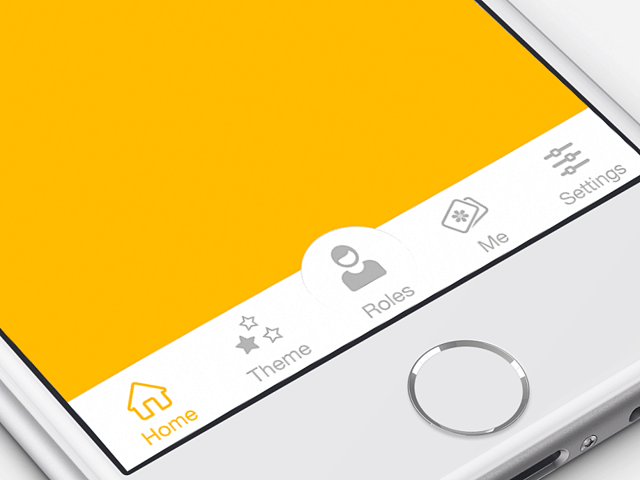
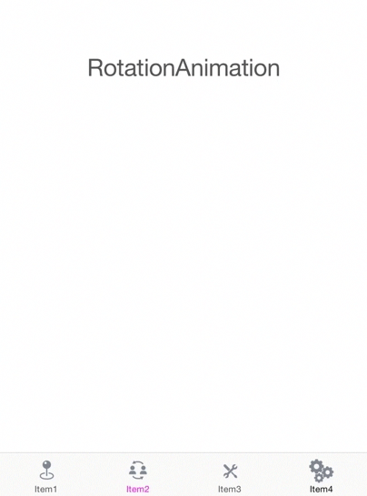

# RAMAnimatedTabBarController
[]()
[]()
[](https://developer.apple.com/swift/)
[]()
[](http://twitter.com/Ramotion)


RAMAnimatedTabBarController is a Swift module for adding animation to tabbar items. It has pre-set of animations which we prepare for you, and ability to use any custom animation you want. With this module you can make your tabbar alive like our [shot on dribbble](https://dribbble.com/shots/1766396-Animated-Tab-Bar-Icons?list=searches&tag=ramotion&offset=...):



The [iPhone mockup](https://store.ramotion.com/product/iphone-6-mockups?utm_source=gthb&utm_medium=special&utm_campaign=animated-tab-bar) available [here](https://store.ramotion.com/product/iphone-6-mockups?utm_source=gthb&utm_medium=special&utm_campaign=animated-tab-bar).


Screencast from our Demo



## Requirements

- iOS 7.0+
- Xcode 6.1

## Installation

Just add the RAMAnimatedTabBarController folder to your project.

or use [CocoaPods](https://cocoapods.org) with Podfile:
``` ruby
pod 'RAMAnimatedTabBarController', '~> 1.0.6'
```

## Usage

1. Create a new UITabBarController in your storyboard or nib.

2. Set the class of the UITabBarController to RAMAnimatedTabBarController in your Storyboard or nib.

3. For each UITabBarItem, set the class to RAMAnimatedTabBarItem.

4. Add a custom image icon for each RAMAnimatedTabBarItem

5. Add animation for each RAMAnimatedTabBarItem : 
   * drag and drop an NSObject item into your ViewController 
   * set its class to ANIMATION_CLASS (where ANIMATION_CLASS is the class name of the animation you want to use)
   * connect the outlet animation in RAMAnimatedTabBarItem to your ANIMATION_CLASS
   [Demonstration video for step 5](http://vimeo.com/112390386)
   			
   			
## Included Animations

* RAMBounceAnimation
* RAMLeftRotationAnimation
* RAMRightRotationAnimation
* RAMFlipLeftTransitionItemAniamtions
* RAMFlipRightTransitionItemAniamtions
* RAMFlipTopTransitionItemAniamtions
* RAMFlipBottomTransitionItemAniamtions
* RAMFrameItemAnimation
* RAMFumeAnimation

## Creating Custom Animations
1. Create a new class which inherits from RAMItemAnimation:
	
  ``` swift
     class NewAnimation : RAMItemAnimation
  ```
2. Implement the methods in RAMItemAnimationProtocol: 


  ``` swift
    // method call when Tab Bar Item is selected
    override func playAnimation(icon : UIImageView, textLable : UILabel) {
      // add animation
    }
  ```  
  ``` swift
    // method call when Tab Bar Item is deselected
    override func deselectAnimation(icon : UIImageView, textLable : UILabel, defaultTextColor : UIColor) {
      // add animation
    }
  ```    
  ``` swift
    // method call when TabBarController did load
    override func selectedState(icon : UIImageView, textLable : UILabel) {
      // set selected state  
    }
  ```

3. Example:

``` swift
class RAMBounceAnimation : RAMItemAnimation {
    
    override func playAnimation(icon : UIImageView, textLable : UILabel) {
        playBounceAnimation(icon)
        textLable.textColor = textSelectedColor
    }
    
    override func deselectAnimation(icon : UIImageView, textLable : UILabel, defaultTextColor : UIColor) {
        textLable.textColor = defaultTextColor
    }
    
    override func selectedState(icon : UIImageView, textLable : UILabel) {
        textLable.textColor = textSelectedColor
    }

    func playBounceAnimation(icon : UIImageView) {
      
        let bounceAnimation = CAKeyframeAnimation(keyPath: "transform.scale")
        bounceAnimation.values = [1.0 ,1.4, 0.9, 1.15, 0.95, 1.02, 1.0]
        bounceAnimation.duration = NSTimeInterval(duration)
        bounceAnimation.calculationMode = kCAAnimationCubic
        
        icon.layer.addAnimation(bounceAnimation, forKey: "bounceAnimation")
    }
}
```

## Developer Information

Designed & Developed in [Ramotion - Digital Design Agency](http://ramotion.com?utm_source=gthb&utm_medium=special&utm_campaign=animated-tab-bar)


Follow us on [Twitter](http://twitter.com/ramotion).

